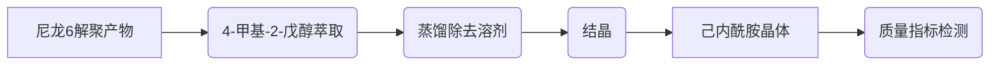

# 实验方案

### 一、文献检索关键词

>* $polyamide6/polyurethane-blended\quad textiles $   
>* $depolymerization$
>* $regenerated\quad\varepsilon-caprolactam$
>* 

### 二、尼龙6解聚产物中己内酰胺单体分离纯化

### 一、萃取相图的测定

### 二、萃取溶剂筛选

* $50wt\%$4-甲基-2-戊醇+$50wt\%$环己烷
* 十二烷基苯酚
* 

