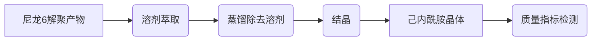

# 实验方案

##  一、文献检索关键词

>* $polyamide6/polyurethane-blended\quad textiles $   
>* $depolymerization$
>* $regenerated\quad\varepsilon-caprolactam$
>* 

## 二、尼龙6解聚产物中己内酰胺单体分离纯化

### 1.初步回收方案

### 2. 萃取溶剂筛选

* $50wt\%$4-甲基-2-戊醇+$50wt\%$环己烷
* 十二烷基苯酚
* 考察醋酸异丙酯，感觉不太行

### 3. 萃取相图的测定

## 三、锦氨纶布料解聚回收己内酰胺单体

### 1.可能回收方案

将氨纶从锦氨纶混纺布料中分离出来，使用DMF（N,N-二甲基甲酰胺）溶剂（文献参考）
